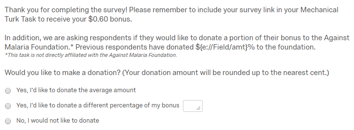

```{r setup, include=FALSE}
knitr::opts_chunk$set(echo = TRUE)
```

```{r, echo=FALSE, warning=FALSE}
data <- read.csv("./clean_data/qualtrics_data.csv")

# Rename columns
names(data) <- c("x", "start_date", "end_data", "status", "ip_address", "progress", "duration_secs", 
               "finished", "recorded_date", "response_id", "last_name", "first_name",
               "email", "reference", "latitude", "longitude", "distribution_channel",
               "age", "gender", "state", "income", "prev_donate", "employment_status", "grammar",
               "first_click", "last_click", "page_submit", "num_clicks", "donate", "custom_donation",
               "donation_notification", "sid", "mturkcode", "group", "amt", "topics", "donate_perc",
               "donate_amount", "bonus_amount", "donate_yn", "proofread", "grammar_score", "rank")

# Set data.table
library(data.table)
data <- data.table(data)

data <- data[sid %in% c("p2","p3","p4","p5"),]
data <- data[rank == 1,]
study1 <- data[sid %in% c("p2","p3","p4"),]
study2 <- data[sid == "p5",]
```

# Abstract
Charitable fundraising efforts typically make use of suggested donation amounts. While this practice is quite common across various techniques and organizations there exists little research regarding optimizing these suggested amounts. This gap in knowledge is particularly concerning given the strong donor preference for utilizing suggested amounts in fundraising efforts. To this end we set about conducting a lab experiment to gather additional information regarding the effectiveness of the anchoring technique on soliciting donations. We sought to measure the effect of the anchor on donation participation and donation amounts. We found little evidence for a preference on suggested donation amounts in the lab experiments, though that could be attributed to the small sample sizes and small donation amounts. In our experiment because there was no significant preference over anchorage amounts we did find some evidence that increased anchors (50% vs 25%) did lead to larger fundraising amounts. In addition we also found evidence supporting previous research that donors respond more favorably to round suggested donations as opposed to non-round (50% vs 37%). In a second study we looked to examine the same effects where we simulated increased wealth by doubling the endowment effect of the lab setup but results proved inconclusive.

\newpage

# Introduction
Charity organizations employ a wide and varied set of strategies when seeking donations including appeals to sentimentality, appeals to logic, peer pressure, and an ever-increasing array of creative stunts such as the Ice Bucket Challenge for ALS research.  However, the tried and true method of direct mailing of fundraising still exists whether it be in paper or electronic format. How can fundraisers make these efforts more successful? Well, if we are to borrow a concept from behavioral economics perhaps the answer is as simple as increasing the suggested donation amount. This strategy attempts to take advantage of a cognitive bias known as anchoring. But just how effective is this technique in practice and is there a limit or a point of diminishing return? This experiment seeks to measure the extent of changes in response rate and donation amount when changes in suggested donation amount occur. We will begin by analyzing the current research and theories in this area. After that we will discuss the hypotheses of our experiment. We then cover the experimental design focusing on treatment, subject selection and randomization, important covariates, and outcome measures. Next we discuss the results of two related studies we conducted. We conclude with a discussion of the results and some issues noted during the experiment. The paper includes an appendix with the regression output for the studies.

# Theory
The concept of anchoring was first proposed by Amos Tversky and Daniel Kahneman.[^1] They define anchoring as a psychological heuristic or shortcut that when individuals are making uncertain decisions of a quantitative nature they are unduly influenced by anchors or readily available numbers. This effect is most easily demonstrated in negotiations where studies have shown that the opening offer has a stronger influence on the outcome of negotiations than counteroffers.[^2] But the effect can extend to even random anchors. In a study conducted by Dan Ariely he found that when he asked participants to write the last two digits of their social security number and then have them bid on objects such as wine and computer equipment with unknown values, those with higher last two social security numbers submitted bids 60-120 percent higher.[^3]

Previous research has shown the pros and cons of anchoring approaches in this context. In a paper by Verhaert and Van den Poel they went on to show heterogeneous effects depending on the lifecycle of the donor.[^4] In that study they showed evidence that new donors and donors who had not donated in an extend amount of time responded positively to anchors associated with their most recent donation whether to that charity or another. While active donors responded most positively to an anchor suggesting the average donation amount. The study was interesting in its revelation that some donors maintain an internal reference anchor that if violated could have negative impact on donation participation.

Additional research by Reiley and Samek on the topic of suggested donations found evidence that donors responded more positively to round or expected intervals as opposed to non round numbers.[^5] For example their study found that donors would be more likely to donate in a scenario suggesting $100 as opposed to $95 despite $100 being a larger amount. Their study also found some evidence supporting the theory of downward sloping demand in regards to suggested donation amounts. That is for each suggested donation amount in increasing order they found donors less likely to respond. This is certainly an interesting finding because it would speak to a diminishing return on anchoring points and may again provide further evidence of internal anchoring points in the donor that if fundraisers are looking to raise the most money should be cognizant of. Reiley and Samek also found that given an ask string of donation amounts, donors strongly favored suggested amounts despite always having the option to write in an amount suggesting that the amount of thought that goes into a suggested donation should be seriously considered.

# Hypothesis
1. Increased Donation Amounts: recipients of fundraising solicitations with higher suggested donation amounts who choose to donate will donate larger sums.
2. Decreased Donation Participation: recipients of fundraising solicitations with higher suggested donations amounts will choose not to donate more often.
3. Decreased Donation for Abnormal Suggestions: recipients of fundraising solicitations with non round amounts will choose not to donate more often.
 
Given the same fundraising message but with a larger suggested donation, recipients influenced by the anchoring effect will choose to donate larger sums. In cases of donation solicitation especially where the recipients are unfamiliar with the cause or its effectiveness their ability to generate a reasonable donation amount will be limited and thus we expect them to be highly influenced by the suggested amount. For the same reason, we may expect lower donation participation as participants evaluate that anchor point as an unmanageable request even though they could actively choose to donate less.

# Experimental Design

## Study 1 
This study sought to analyze the effects of providing subjects with average donation rate information to see how it would affect donation rate and amounts. In addition, the study also looked at the effect of presenting subjects with non-round or anticipated amounts and how that affects donation rate and amount. Subjects were recruited via Mechanical Turk and directed to fill out a survey on the Qualtrics platform for which they would be paid 5 cents with the ability to earn an additional 60 cents by completing the survey successfully.

Subjects were requested to fill out a survey that asked 6 questions intended to gather covariate information which will be discussed later, perform a proofreading task, and finally were presented with the option to donate a portion their bonus reward to a charity. The proofreading task served two purposes: 1. To provide an endowment effect wherein the subject believes they have earned the bonus amount and are thus more likely to respond as if the money was already theirs. 2. To prime the subject to be empathetic to future donation solicitation. This was done to simulate donation information being provided by charities in fundraising efforts and to increase donation rates to decrease variance in response rate to improve statistical power.

### Treatment
In this experiment design the primary treatment was the average donation rate presented to subjects during the solicitation question in the survey. The donation solicitation along with response options can be found below. Participants who selected option 2 could enter a donation percentage amount.



### Subjects
As previously mentioned subjects were recruited from Mechanical Turk but respondents were limited to only users from the United States. The sample characteristics can be found below.

### Covariates
Covariate information was primarily gathered through the Qualtrics survey platform. As most responses were solicited from the respondents accuracy cannot be guaranteed and most covariates reflect self-reported values. The following list of covariates was gathered:

- Age
- Gender
- State of Residence
- Latitude/Longitude coordinates of IP Address
- Income level
- Whether or not respondents had donated in the previous year
- Employment status
- Time spent on proofreading task
- Number of grammatical errors identified in task

### Outcomes
The potential outcome measure of primary interest was donation amount. As a secondary measure, we would also record donor response with any donation >0 equaling 1 and no donation equaling 0. Outcomes were gathered based on subject responses to the Qualtrics survey.

## Study 2
Study 2 repeated the same exact experiment design but the advertised and delivered bonus was doubled to study the potential effect of simulated increased wealth on donation behavior as it related to our previous outcome measures of donation amount and donation response.

# Results
Our results consist of two related studies. In the first study we examined the impact of suggested donation amounts on donation participation and donation amounts (measured in percent) when users were endowed with a 60 cent bonus. Study 2 repeats the same process but with $1.20 bonus in attempt to see if behavior changes with larger endowment effects or simulated wealth. As we will discuss we don't believe that was the effect we found but instead that the users we motivated to partake in study 2 were different.

## Study 1
Study 1 consisted of 196 observations of Mechanical Turk workers based in the United States in the month of April 2017.

Prior to performing our analysis, we did a covariate check in order to examine the balance of a subset of covariates. The covariates examined were:

- Proofreading Score
- Gender
- Age
- Whether or not respondents had donated in the previous year
- Number of grammatical errors identified in task

Our covariate test passed despite our relatively small sample size, suggesting that the three groups are well-balanced. You can see a summary of mean values for various covariates in table 1.

```{r, echo=FALSE, results='asis', warning=FALSE, message=FALSE}
data_with_groups <- subset(study1, group == 1 | group == 2 | group == 3)
summary.table <- data_with_groups[ , .(
                        proofread = mean(proofread, na.rm = TRUE), 
                        proofread.se = sd(proofread, na.rm = TRUE)/sqrt(sum(!is.na(proofread))),
                        gender = mean(gender == "Male", na.rm = TRUE),
                        gender.se = sd(gender == "Male", na.rm = TRUE)/sqrt(sum(!is.na(gender))),
                        age = mean(age), 
                        age.se = sd(age)/sqrt(sum(!is.na(age))),
                        prev_donate = mean(prev_donate == "Yes", na.rm = TRUE),
                        prev_donate.se = sd(prev_donate == "Yes", na.rm = TRUE)/sqrt(sum(!is.na(prev_donate))),
                        grammar_score = mean(grammar_score),
                        grammar_score.se = sd(grammar_score)/sqrt(sum(!is.na(grammar_score)))
                        ), 
                    by = group]
summary_df = function(input_df, var1 = "group") {
  df_columns = colnames(input_df)
  mean_col = df_columns[!grepl(".se", df_columns) & df_columns != var1]
  
  summary.df = data.frame(group = input_df[[1]])
  for(i in c(1:length(mean_col))){
    summary.df[i + 1] = paste(formatC(input_df[[2 * i]], digits = 2, format = "f")," (", formatC(input_df[[2 * i + 1]], digits = 2, format = "f"), ")", sep = "")
  }
  colnames(summary.df) = append(var1, mean_col)
  return(summary.df)
}

summary.table.txt = summary_df(summary.table)
library(stargazer)
stargazer(summary.table.txt[order(summary.table.txt$group),], summary = FALSE, header = FALSE, title = "Summary Table of Key Covariates", digits = 2, type="latex", omit="3", rownames = FALSE)
```

For our analysis, we ran four separate regressions:

- $P_i = \beta_0 + \beta_1 *proofread + \beta_2 *male + \beta_3 *age + \beta_4 *previouslydonated + \beta_5 *grammarscore + \beta_6 *group2 + \beta_7 *group3$
- $P_i = \beta_0 + \beta_1 *group2 + \beta_2 *group3$

where $P_i$ is the donation percentage of respondents

- $D_i = \beta_0 + \beta_1 *proofread + \beta_2 *male + \beta_3 *age + \beta_4 *previouslydonated + \beta_5 *grammarscore + \beta_6 *group2 + \beta_7 *group3$
- $D_i = \beta_0 + \beta_1 *group2 + \beta_2 *group3$

where $D_i$ is the binary variable measuring whether a respondent donated or not

The regression output can be found in Table 6 in the appendix.

Our regressions suggest that those who donated spent more time proofreading. One way that this could be interpreted is that those who were more careful during the survey were more likely to be impacted by the essay in the survey, which describes the issue of malaria. This may have led to an stronger empathetic response amongst careful respondents when they were asked to donate to a nonprofit that addresses the issue of malaria.   

Another interesting (and perhaps unsurprising) finding in our regressions is that those who donated in the previous year were more likely to donate during our study. This was the case for all three groups involved in the study.

When examining donation rates amongst all three groups, we found that Group 3 (50% suggested donation) and Group 1 (25% suggested donation) had a somewhat similar rate of donation and Group 2 (37.5% suggested donation) had the lowest rate of donation of the three groups. This result is interesting, as we would expect the rate of donation to decrease from Group 1 to Group 2 and then from Group 2 to Group 3 if the hypothesis of downward sloping demand was true. This result does echo results found in Reiley and Samek's study. One likely explanation for this result is that subjects may prefer to donate when the suggested amount is a rounded percentage.

In regards to the donation amount (in percentages), Group 3 donated the most on average (controlling for all other variables in the regressions) and Group 2 donated the least. This is likely due to the high fraction of non-donors in Group 2 as compared to the other two groups. This also due to respondents strong preference to donate the suggested donation amount as opposed to a write in amount. You can see the percentage of users who donated the suggested amount in each group. (Group 2 is the non round suggestion).

```{r, echo=FALSE, results='asis'}
donations <- study1[donate_yn==1, .(mean(donate_perc==amt)*100, mean(donate_perc)), by=group]
colnames(donations) <- c("Group", "Donors Selecting Suggested Donation", "Mean Donation %")
stargazer(donations[order(donations$Group),], summary = FALSE, header = FALSE, title = "Study 1 Donation Activity", 
          digits = 2, type="latex", rownames = FALSE)
```

## Study 2
Study 2 consisted of 99 observations of Mechanical Turk workers based in the United States over the month of April 2017.

Again we begin with an analysis of covariate balance for study 2. We see slightly less balance in study 2 primarily due to the decreased number of participants allowing a wider variance.

```{r, echo=FALSE, results='asis'}
data_with_groups <- subset(study2, group == 1 | group == 2 | group == 3)
summary.table <- data_with_groups[ , .(
                        proofread = mean(proofread, na.rm = TRUE), 
                        proofread.se = sd(proofread, na.rm = TRUE)/sqrt(sum(!is.na(proofread))),
                        gender = mean(gender == "Male", na.rm = TRUE),
                        gender.se = sd(gender == "Male", na.rm = TRUE)/sqrt(sum(!is.na(gender))),
                        age = mean(age), 
                        age.se = sd(age)/sqrt(sum(!is.na(age))),
                        prev_donate = mean(prev_donate == "Yes", na.rm = TRUE),
                        prev_donate.se = sd(prev_donate == "Yes", na.rm = TRUE)/sqrt(sum(!is.na(prev_donate))),
                        grammar_score = mean(grammar_score),
                        grammar_score.se = sd(grammar_score)/sqrt(sum(!is.na(grammar_score)))
                        ), 
                    by = group]
summary.table.txt = summary_df(summary.table)
stargazer(summary.table.txt[order(summary.table.txt$group),], summary = FALSE, header = FALSE, title = "Summary Table of Key Covariates", digits = 2, type="latex", omit="3", rownames = FALSE)
```

The regression output can be found in Table 7 in the appendix.

The results from this study confound many of the results found in the previous study. We see that the time spent proofreading has an estimated negative impact on both likelihood to donate and amount donated though these results are not statistically significant they are in the opposite direction than study 1.

We see that previous donation history still has an estimated positive impact on both likelihood to donate and amount donated although the effect is far weaker than the one estimate in study 1.

When examining donation rates amongst all three groups, we again found that Group 3 (50% suggested donation) and Group 1 (25% suggested donation) had a somewhat similar rate of donation although now Group 2 (37.5% suggested donation) had the highest rate of donation of the three groups. This result is the direct opposite of findings of study 1 and confounds those results. We theorize that we may be seeing evidence of heterogeneous treatment effects where the respondents attracted in study 2 responded more positively to non round suggestions perhaps giving them more authenticity than round numbers though this would need to be investigated further.

In regards to the donation amount (in percentages), Group 2 donated the most on average (controlling for all other variables in the regressions) and Group 1 donated the least. This is likely due to Group 2 having the highest response rate as well as some variance due to small sample size. The one consistent result is the respondent preference for the suggested donation amount. You can see the percentage of users who donated the suggested amount in each group. (Group 2 is the non round suggestion).

```{r, echo=FALSE, results='asis'}
donations <- study2[donate_yn==1, .(mean(donate_perc==amt)*100, mean(donate_perc)), by=group]
colnames(donations) <- c("Group", "Donors Selecting Suggested Donation", "Mean Donation %")
stargazer(donations[order(donations$Group)], summary = FALSE, header = FALSE, title = "Study 2 Donation Activity", 
          digits = 2, type="latex", rownames = FALSE)
```

We did some further analysis on the covariates between the two studies which can be seen in Table 5. The breakdown in self reported income levels does seem to suggest that we recruited more lower income individuals with the promise of a larger bonus in Study 2. We also compared the same covariates that we examined in the randomization checks and while there is no statistical difference between the groups we still theorize there is some unobserved heterogeneity that makes these groups different in substantial ways that may explain some of the confounding results we observe in our outcomes variables. We suspect this is a factor primarily due to the difference in the amount of time it took for HITs to complete on Mechanical Turk. While for Study 1 our HITs remained open for days at a time. Study 2's HIT was completed in a matter of hours. The alternative conclusion is that the difference in results is attributable to the difference in bonus amounts.

```{r, echo=FALSE}
study_1 <- study1[rank==1 & !is.na(donate),prop.table(table(income))]
study_2 <- study2[,prop.table(table(income))]
comb <- rbind(study_1,study_2)
comb <- comb[,c(11,1:10,12)]
barplot(comb,beside = TRUE, legend.text = c("Study 1","Study 2"), xlab ="Income in $1000s", main="Income by Study",
        names.arg = c("0-10","10-20","20-30","30-40","40-50","50-60","60-70","70-80",
                      "80-90","90-100",">100","No Answer"))
```

```{r, echo=FALSE, results='asis'}
data_with_groups <- subset(data, group == 1 | group == 2 | group == 3 & sid %in% c("p2","p3","p4","p5"))
data_with_groups$study = ifelse(data_with_groups$sid == "p5", "Study 2", "Study 1")
summary.table <- data_with_groups[ , .(
                        proofread = mean(proofread, na.rm = TRUE), 
                        proofread.se = sd(proofread, na.rm = TRUE)/sqrt(sum(!is.na(proofread))),
                        gender = mean(gender == "Male", na.rm = TRUE),
                        gender.se = sd(gender == "Male", na.rm = TRUE)/sqrt(sum(!is.na(gender))),
                        age = mean(age), 
                        age.se = sd(age)/sqrt(sum(!is.na(age))),
                        prev_donate = mean(prev_donate == "Yes", na.rm = TRUE),
                        prev_donate.se = sd(prev_donate == "Yes", na.rm = TRUE)/sqrt(sum(!is.na(prev_donate))),
                        grammar_score = mean(grammar_score),
                        grammar_score.se = sd(grammar_score)/sqrt(sum(!is.na(grammar_score)))
                        ), 
                    by = study]
summary.table.txt = summary_df(summary.table, "study")
stargazer(summary.table.txt[order(summary.table.txt$study),], summary = FALSE, header = FALSE, title = "Summary Table of Key Covariates", digits = 2, type="latex", omit="3", rownames = FALSE)
```

# Discussion

## Experimental Concerns

### Endowment effect concerns
Among the respondents in our study 1 and study 2 data there were 18 subjects who completed the proofreading task in under 60 seconds which potentially indicates that they did not give it proper attention. The concern here is that if users did not actually perform the proofreading task they may not have treated the donation question the same having not properly received the endowment effect as well as the secondary effect of generating empathy for the charity. We have chosen not to remove the respondents but instead have controlled for this as a covariate. As we saw from our previous analysis there is some evidence to support the hypothesis that increased time spend on the proofreading task did lead to more donation activity. Below is a histogram of the number of respondents who completed the task under 60 seconds broken into 10 second intervals.

```{r, echo=FALSE}
hist(data[proofread <60 & rank==1 & !is.na(donate),]$proofread, main = "Respondents completing proofreading task under 60 seconds",
     xlab = "Seconds")
```

### Attrition 
Due to the nature of our experiment design randomization occurred just before treatment and outcome measurement. Essentially there was no room for attrition. We did have individuals who dropped out of the survey prior to randomization and exposure to treatment and we discarded those results as there were no outcomes to measure. We may be subject to some self selection which might limit the generalizability of the results but we have no concerns regarding differential attrition.

### Exclusion restriction
Our experiment design called for creating an endowment effect and in that process we also tried to induce empathy but as all users were equally exposed to these we do not suspect any exclusion restrictions of exposure to treatment. All users were exposed to the same exact treatment question with the only change being the number. 

### Non-interference
There are a couple of non-interference concerns though we have little evidence of them. The major theme is that users are discussing the study either in person or through online messaging boards. There were some posts which highlighted that the task was available but nothing regarding the contents of the survey. If there was a violation of non-interference of it could certainly bias the results depending on the effects of the interference but we are assuming if this did occur the effects are negligible.

## External Validity
As we were unable to find a partner charity organization to work with we were forced to adapt to a more lab based experiment design. The big concern here is how generalizable these results become under the specific conditions they were gathered. The pool of respondents on Mechanical Turk are certainly different in characteristics than the general donor pool of charities whom could use this information in fundraising efforts (though based on self reported previous donation rates our pool compares just slightly worse than the average American population based on IRS tax data). Another factor is that despite an attempt to create an endowment effect, ultimately the donation decision being made was based off of money not yet received and of a very small amount. Effects may differ under larger donation amounts. We theorize that this small number effect was what prevented us from finding downward sloping demand at higher suggested donations as was found in other studies. If our results were to hold at larger scales then potentially the highest suggested donation amount would receive equal donation activity to lower donation amounts. Our most confident result was in the preference for round numbers as we feel the experiment as designed still has valid things to say regarding this effect. Although our results are inconclusive with the second study providing some evidence of the opposite effect we feel given a higher powered study this effect could be reasonably estimated.

## Future Work
This study has provided interesting insights but there is still room to be gained. Below are a few things we would recommend as additional follow ups that we ourselves would have taken on given more time and budget:

1. The first area for additional research would be to conduct a similar study in a field setting where we would not need to validate the effect of endowment effects and could gain causal inference about actual donor behavior.
2. Based on the data we have gathered so far the first step would be to power up the experiment by gathering more observations. While some of our findings are on the cusp of statistical significance others could benefit from a larger study.
3. Increasing the number of suggested donation treatments would be instructive to better understand the "demand" curve for donations. While we have some evidence of the predicted downward slope we cannot say for sure that the slope is not in fact flat.
4. There are also other interesting interaction effects that could be explored through a factorial design such as with the solicitation style i.e. more specific, individual type stories to elicit a warm glow in donors, data-driven stories to elicit unbridled altruism, etc.

# Conclusion
We would like to revisit the hypotheses previously posed as we draw some conclusion regarding these studies.

1. Increased Donation Amounts: recipients of fundraising solicitations with higher suggested donation amounts who choose to donate will donate larger sums.
2. Decreased Donation Participation: recipients of fundraising solicitations with higher suggested donations amounts will choose not to donate more often.
3. Decreased Donation for Abnormal Suggestions: recipients of fundraising solicitations with non round amounts will choose not to donate more often.

Study 1 found some evidence for hypothesis 1 with the round donation amounts. Both the simple and covariate controlled models in Table 6 found a significant positive effect (at the 10% level unadjusted for multiple tests) for donation percentage for group 3 over the baseline of group 1 which were the 50% and 25% levels respectively. The hypothesis did not hold for group 2 when including non donors and even when factoring them out the mean donation percentage for group was nearly identical to group 1. Study 2 found similar effects though less statistically significant due to a smaller number of observations. Mean donations increased from group 1 to group 2 to group 3 and all groups had over 50% of donors who donated choosing the suggested amounts. This could be evidence of the anchoring effect or the preference of users to avoid cognitive cost in determining the amount to donate.

For hypothesis 2 we found little to no evidence of this when comparing group 1 to group 3 where donation rates were nearly identical. There was a difference in group 2 donation rates but this is a more related to the 3rd hypothesis which we will cover next. Study 2 did not produce any statistically significant differences in donation rates among the three groups. This hypothesis is well grounded in economic theory and common sense would tell us that we could not just increase the suggested amount infinitely and expect no change in donation percentages. There are a few theories as to what may explain these results. First, we did not have enough price points to establish a "donation demand" curve. Second, due to the nature of endowing the individuals with and asking for a percentage of that amount we guaranteed that all respondents could donate at least that much whereas in a true donation solicitation with fixed amounts some suggested donation amounts may exceed the available discretionary income of the individual. Lastly, because of the experiment nature users may not have experienced the same loss aversion when donating amounts due to a lack of endowment effect and the small nature of donation request (at most $1.20).

We identified some evidence of hypothesis 3 in study 1. In the covariate controlled regression the effect of the non round donation amount (37%) was significantly negative (at the 10% level unadjusted for multiple tests). This data also shows up in the number of donors who chose to donate at that level preferring to donate a written in amount. The only instance in both studies where the suggested donation amount was not favored by donors. Study 2 actually found evidence directly refuting the finding from study 1 with the non round amount producing the most donations though this result did not achieve statistical significance. This was a surprising finding and most certainly due to some unobserved heterogeneity between our study 1 participants and study 2 participants but perhaps warranting of further research to see if there certain individuals more or less likely to respond non round amounts. There are two competing theories with non round amounts. One, that individuals donors all things equal prefer to minimize cognitive costs when choosing to donate and non round amounts produce an anchor that is more difficult to compare with their internal assessment of how much they are willing to donate. The second theory is that individuals in viewing a suggested donation amount attribute more authenticity to a non round amount as they assess the likelihood of a round amount naturally occurring to be small. This theory would affect users with weak internal anchors more so than those with a strong donation reference point.

We believe that further research into this area is required as the existing literature still leaves many questions to answer. We also believe the concerns of generalizability could be laid to rest with a fully funded, high powered field experiment in this area and we hope to see continued research on this topic.


\newpage

# References

Kristensen, Henrik, and Tommy Gärling. "The Effects of Anchor Points and Reference Points on Negotiation Process and         Outcome." Organizational Behavior and Human Decision Processes 71, no. 1 (1997): 85-94. Accessed April 2, 2017.          doi:10.1006/obhd.1997.2713. 

Reiley, David, and Anya Savikhin Samek. "How Do Suggested Donations Affect Charitable Gifts? Evidence from a Field           Experiment in Public Broadcasting." SSRN Electronic Journal. Accessed April 2, 2017. doi:10.2139/ssrn.2702174.

Teach, Edward. "Avoiding Decision Traps." CFO. May 11, 2015. Accessed April 02, 2017.                                        http://ww2.cfo.com/human-capital-careers/2004/06/avoiding-decision-traps/.

Tversky, Amos, and Daniel Kahneman. "Judgment under uncertainty: Heuristics and biases." Judgment under uncertainty,        September 27, 1974, 1124-131. doi:10.1017/cbo9780511809477.002.

Verhaert, Griet Alice, and Dirk Van Den Poel. "Improving Campaign Success Rate by Tailoring Donation Requests along the      Donor Lifecycle." Journal of Interactive Marketing 25, no. 1 (2011): 51-63. doi:10.1016/j.intmar.2010.09.001. 

\newpage

# Appendix

```{r, echo=FALSE, results='asis'}
regress_s1 <- lm(donate_perc ~ factor(group), data = study1)
regress_s2 <- lm(donate_perc ~ proofread + gender + age + factor(income) + prev_donate + grammar_score + factor(group), data = study1)
regress_s3 <- lm(donate_yn ~ factor(group), data = study1)
regress_s4 <- lm(donate_yn ~ proofread + gender + age + factor(income) + prev_donate + grammar_score + factor(group), data = study1)

stargazer(regress_s1, regress_s2, regress_s3, regress_s4, summary = FALSE, header = FALSE, 
          title = "Study 1 Regression", digits = 2, type="latex", omit = "income")
```

```{r, echo=FALSE, results='asis'}
regress_s5 <- lm(donate_perc ~ factor(group), data = study2)
regress_s6 <- lm(donate_perc ~ proofread + gender + age + factor(income) + prev_donate + grammar_score + factor(group), data = study2)
regress_s7 <- lm(donate_yn ~ factor(group), data = study2)
regress_s8 <- lm(donate_yn ~ proofread + gender + age + factor(income) + prev_donate + grammar_score + factor(group), data = study2)

stargazer(regress_s5, regress_s6, regress_s7, regress_s8, summary = FALSE, header = FALSE, 
          title = "Study 2 Regression", digits = 2, type="latex", omit = "income")
```

```{r, echo=FALSE, results='asis'}
regress_s9 <- glm(donate_yn ~ factor(group), family = "binomial", data = study1)
regress_s10 <- glm(donate_yn ~ proofread + gender + age + factor(income) + 
                     prev_donate + grammar_score + factor(group), family = "binomial", data = study1)
regress_s11 <- glm(donate_yn ~ factor(group), family = "binomial", data = study2)
regress_s12 <- glm(donate_yn ~ proofread + gender + age + factor(income) + 
                     prev_donate + grammar_score + factor(group), family = "binomial", data = study2)

stargazer(regress_s9, regress_s10, regress_s11, regress_s12, summary = FALSE, header = FALSE, 
          title = "Logistic Regressions For Donation Rates", 
          digits = 2, type="latex", omit = "income")
```


[^1]: http://people.hss.caltech.edu/~camerer/Ec101/JudgementUncertainty.pdf
[^2]: http://www.sciencedirect.com/science/article/pii/S0749597897927138
[^3]: http://ww2.cfo.com/human-capital-careers/2004/06/avoiding-decision-traps/
[^4]: http://wps-feb.ugent.be/Papers/wp_10_666.pdf
[^5]: http://spihub.org/site/resource_files/publications/spi_wp_142_samek.pdf 